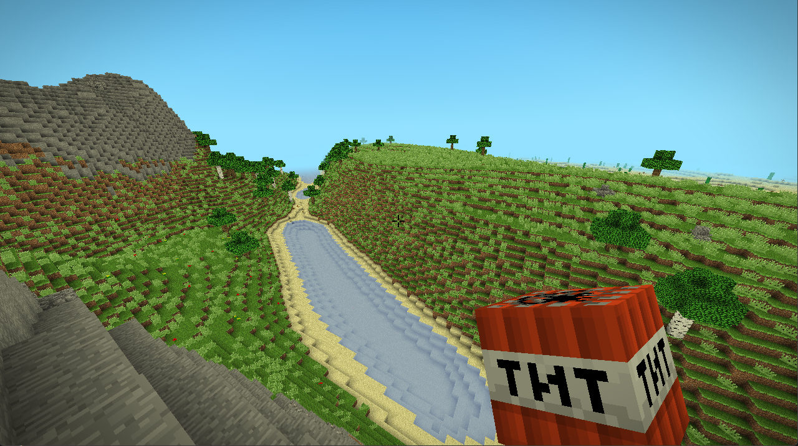
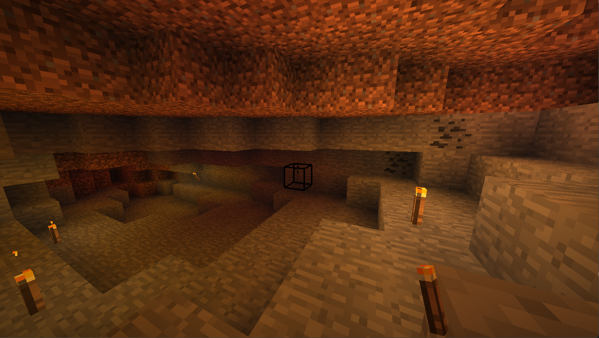
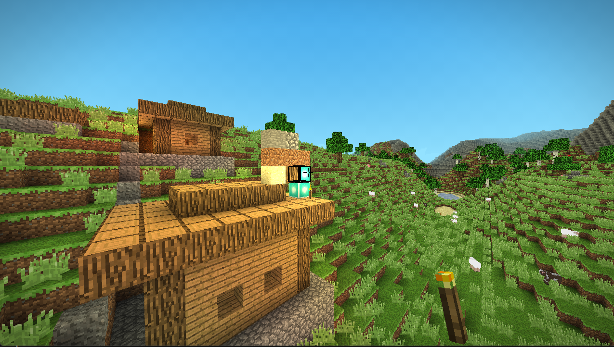
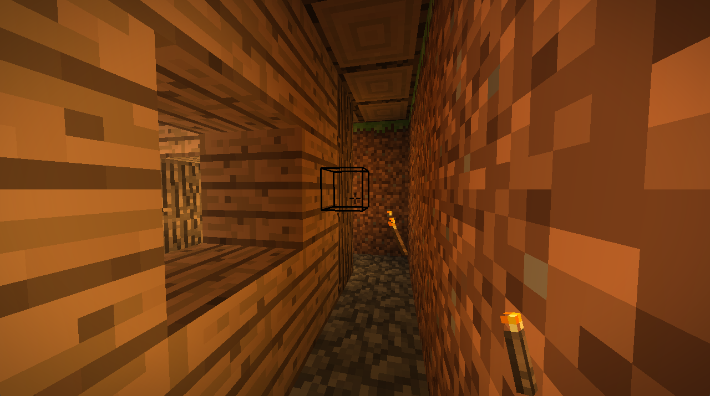
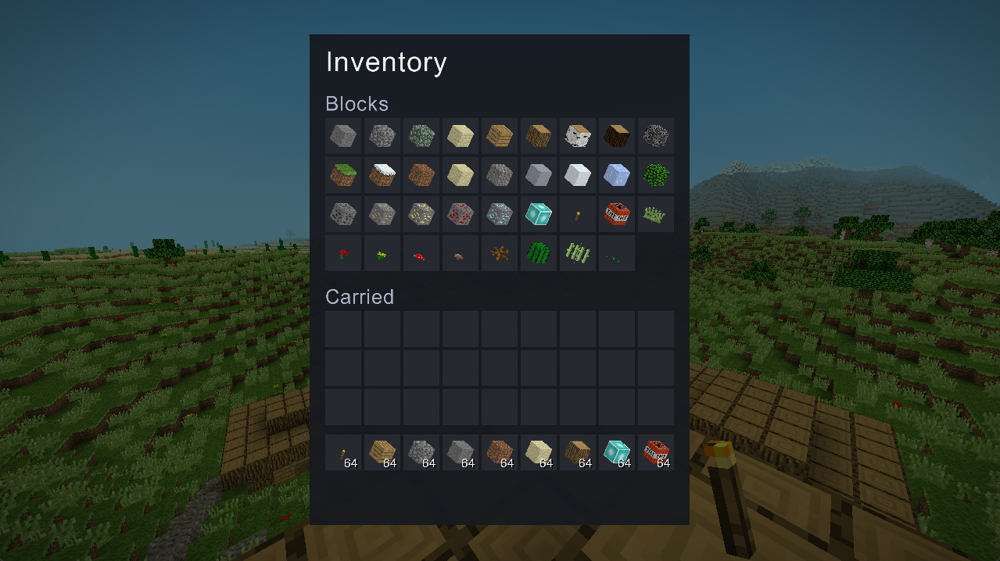
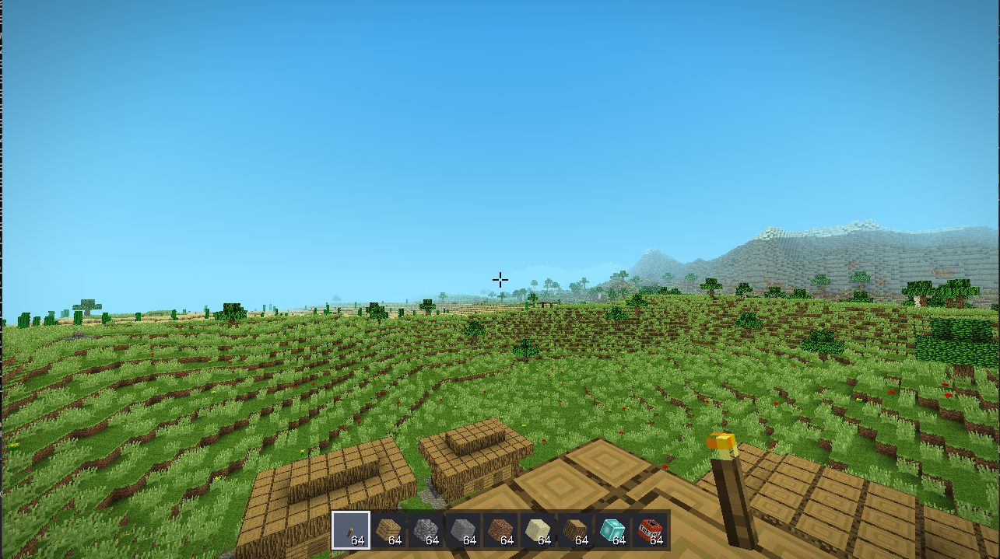
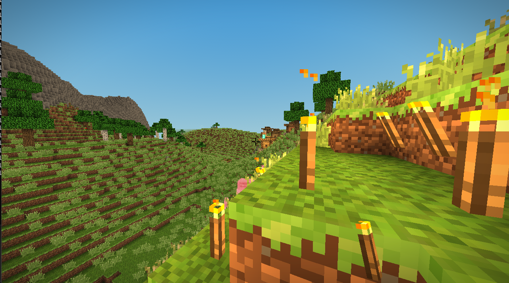
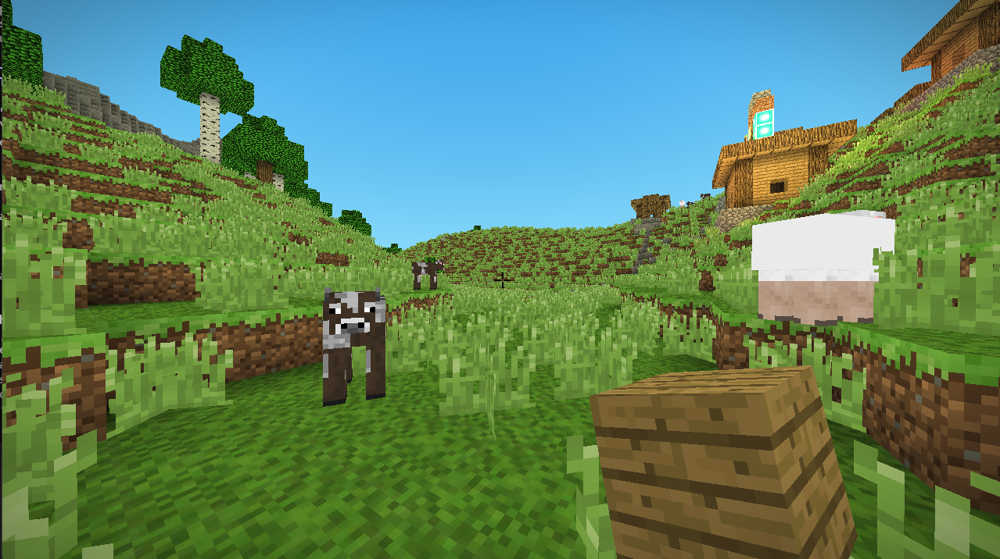

# Design

How the engine works. For building and playing it, see [README.md](README.md).

- [Project layout](#project-layout)
- [Client and server](#client-and-server)
- [World generation](#world-generation)
- [Structures](#structures)
- [Saved worlds](#saved-worlds)
- [Settings](#settings)
- [Game modes](#game-modes)
- [Lighting](#lighting)
- [Inventory](#inventory)
- [Rendering](#rendering)
- [Particles](#particles)
- [Mobs](#mobs)
- [Sound](#sound)
- [Noise](#noise)

## Project layout

| Path                  | Purpose                                                            |
| --------------------- | ------------------------------------------------------------------ |
| `src/Minecraft.Core/` | Engine library                                                      |
| `src/Minecraft.App/`  | Executable entry point                                              |
| `tools/`              | Programs that author assets, neither built nor shipped with the game |

Directories mirror namespaces exactly, so where a type lives is where its `using` says it does.

Inside `Minecraft.Core`:

| Directory            | Contents                                                                 |
| -------------------- | ------------------------------------------------------------------------ |
| `Audio/`             | Sound loading, the mixer, and what decides when anything plays             |
| `Entities/`          | Camera, the player on both sides of a connection, the mobs, and dropped items |
| `Games/`             | Game loop, window, game state, menu flow, input, start argument parsing    |
| `Inventories/`       | Stacks, the slots that hold them, and the catalogue of what can go in one  |
| `IO/`                | Buffered binary reader and writer for network packets                      |
| `Logging/`           | Levelled console logger                                                    |
| `Network/`           | Client, server, sessions, packets, their handlers, and the chat commands   |
| `Physics/`           | Axis aligned boxes and ray tracing                                         |
| `Render/`            | Master renderer, chunk meshing, debug overlays, UI and the menu screens    |
| `Render/Particles/`  | The specks in the air: what moves them, what draws them, what throws them  |
| `Resources/`         | Textures, fonts and models, copied to the output directory on build        |
| `Shaders/`           | GLSL programs and their typed wrappers                                     |
| `Shapes/`            | Block and entity model geometry, and the registries that hold it           |
| `Textures/`          | Texture atlas, texture loading and the offscreen framebuffer               |
| `Utilities/`         | Only what belongs to no one caller: math, noise, directions, object pool   |
| `Worlds/`            | The world itself, and the client and server halves of it                   |
| `Worlds/Biomes/`     | The biomes and the climate map that decides between them                   |
| `Worlds/Blocks/`     | Block types, their states and the registry and palette that number them    |
| `Worlds/Chunks/`     | Chunks, the sections they are sliced into, and what streams them           |
| `Worlds/Generation/` | The generator itself: terrain sampling, ore veins and cave carving         |
| `Worlds/Decoration/` | What each biome grows on its surface, and the trees it grows               |
| `Worlds/Lighting/`   | The flood fill, its four channels and the map it writes into               |
| `Worlds/Structures/` | Villages and the framework that sites them and builds them across chunks   |
| `Worlds/Storage/`    | Reading and writing saved worlds                                           |

`Utilities/` is held to things with no one owner — a type used by exactly one area lives with that area
instead, which is why loading a texture sits in `Textures/`, the VAO wrapper in `Render/`, and the input
wrapper in `Games/` beside the window it reads.

## Client and server

The world only ever changes on the server. A client sends a request — place, break, interact — and applies
nothing until the server broadcasts the result back. Singleplayer runs the same path, with a server hosted in
the same process, so there is one code path rather than two.

Where a client is trusted, it is trusted to *observe* and never to decide: what was aimed at, how long a
button was held, how far a body fell. Every one of those is something this side has just simulated and the
server has only a tenth of a second old copy of, and every one of them is answered by the server deciding what
it is worth. The inventory is the single exception, and a deliberate one — it lives on the client alone, which
is why picking something up is a packet saying what you now have rather than a slot the server wrote into.

Chunks are generated on a background thread and streamed per player, nearest first, by a `ChunkProvider` that
each session owns. A chunk stays loaded while at least one player can see it. Meshing runs on its own thread
and hands one finished mesh to the renderer at a time, which keeps the large vertex buffers reusable and stops
a chunk change from stalling a frame.

## World generation

Which biome a column belongs to is read off a climate map — temperature and moisture, each its own noise
field. The surface blocks come from whichever biome dominates, but the height is a blend of all of them, so a
border comes out as a slope rather than as a step.

| Biome       | Surface             | Character                                                     |
| ----------- | ------------------- | ------------------------------------------------------------- |
| Plains      | Grass over dirt     | Open and gentle, flowers through the grass, few trees          |
| Forest      | Grass over dirt     | Rolling, thick with oak and birch, mushrooms in the shade      |
| Savanna     | Grass over dirt     | Flat topped plateaus with a scramble between one and the next  |
| Desert      | Sand over sandstone | Dunes marching across a broad basin, cactus and dead bush      |
| Mountain    | Bare stone          | Ridged spines and gullies, patched with gravel and moss        |
| Snowy peaks | Snowy grass         | The highest ground there is, pine over its lower shoulders     |


### Land and sea

How much of a column is land at all is decided before any of that, by a much broader field than the climate:
where it falls away the ground is taken down into an ocean basin, and the biome's own hills are faded out along
with it, so a sea has a floor of its own rather than the hills of whatever biome nominally covers it carried on
under the waves. Between the two the ground climbs, which is what puts a shelf and then a beach between a sea
and the land behind it instead of a wall.

Rivers are cut along the line where a second, finer field crosses zero — a contour of a continuous field either
closes on itself or runs forever, so a river never stops halfway. A river only ever lowers ground and only cuts
so deep, so it carves a valley through the highlands and holds water once the land it crosses is low enough to
fill.

Everything left standing open below sea level is then filled with water, which is what puts the sea into a
basin, the water into a river and a lake into any hollow that happens to fall below it. Ground the water
reaches is washed to sand whichever biome it belongs to, and to gravel further down, so every shore has a beach
and a sea reads as getting deeper rather than as one flat basin. Nothing is grown on a seabed, and no village
is sited on one.



### Snow and cliffs

Above the snow line the ground goes under snow, with sheets of glacial ice across part of it. The line itself
wanders, so it does not draw a contour around every summit at exactly the same height. Anywhere the ground
drops three blocks or more from one column to the next is left as the bare rock of its biome, which is what
puts faces on the cliffs and keeps soil off them.

### Underground

Veins of coal, iron, gold, redstone and diamond are laid in bands by depth, along with pockets of dirt, gravel
and clay, and the occasional seam of glowstone that lights a cave when one breaks into it. A vein belongs to
the chunk its centre falls in but is laid down by every chunk it reaches into, so it comes out whole instead of
sheared off at a border. Caves are carved after the veins, so a tunnel cutting through one leaves its face
showing in the wall, and the floor of the world is bedrock.



## Structures

A village is larger than a chunk, so every chunk it covers works out the whole layout from scratch and keeps
only its own slice; two chunks that disagreed would leave a house cut in half along the border.

An `IStructure` therefore has to be a pure function of the world seed and its position, and it reads the ground
through `ITerrainSampler` — which recomputes terrain from the seed — rather than out of the world, since the
neighbouring chunks it spans are not loaded while any one of them is being generated.



## Moving blocks

Water runs and sand falls, and both are driven the same way. A block asks `World.ScheduleBlockUpdate` to be
looked at again in so many ticks, and gets `OnScheduledUpdate` when the delay runs out. Nothing is polled: a
cell earns an entry only when it is placed or when something next to it changed, so an ocean nobody has touched
costs exactly nothing however many million cells of it are loaded. Only the server schedules — a client is told
what came of an update rather than running the same simulation against block changes that arrive a moment apart
and reaching a different answer.

### Water

How deep water stands in a cell is carried by *which block it is* rather than by a state hung off the side of
it. A section stores a bare id per cell and keeps a full state only for the handful of blocks that need one, so
a level held as state would put an object and a dictionary entry behind every cell of every ocean in view. Nine
registry entries — a source, water on its way down a drop, and seven thinning levels of it — cost that once,
and everything downstream reads the depth off the id it was already reading.

A source never empties, which is what makes a lake a lake: breaking its wall floods what is beyond it rather
than draining what is behind. Running water holds nothing of its own and is worked out afresh from what feeds
it every time it is looked at, so cutting a flow off makes it retreat towards its source and dry up. Water
pooled between two sources becomes one itself, which is what makes a pool dug between a pair of them worth
drawing from. Water runs down before it runs sideways, so a drop is a column rather than a spray, and a fall
reaching the floor spreads out from there as strongly as a source would.

Anything with no body of its own — a flower, a torch, a tuft of grass — is washed out of the way. Anything that
holds a body up holds water back. An entity in the water is carried along by it, read off how deep the water
stands against the cells around it: still water cancels out to nothing from every side, and a run of it pushes
towards its shallow end, which is the way it is going.

### Sand and gravel

A block with nothing holding it together drops a cell at a time rather than turning into a falling body of its
own. A fall is therefore a run of ordinary block changes, which everything downstream already knows what to do
with: the clients watching are told about it the way they are told about any other placement, and a pile that
came down while nobody was near is on disk as the blocks it settled into rather than as something in flight.
Somebody standing underneath holds the fall up where it is rather than being buried, since a placement into an
entity is refused and the block would otherwise have gone from the world altogether.

## Saved worlds

```
saves/world/
  level.dat          format version, seed, time of day and game mode, as plain text
  chunks/c.0.-1.gz   one gzipped chunk, named after its grid position
```

Only chunks that were actually **modified** are stored. Everything else is regenerated from the seed on demand,
which is both faster and far smaller than writing terrain nobody has touched — a world that has only been
walked across saves nothing at all.

This works because generation is fully deterministic: the noise fields are seeded from `seed`, and each chunk's
decoration draws from a `Random` seeded by mixing the world seed with the chunk position. Two worlds created
with the same seed generate byte-identical terrain.

> That determinism is load bearing. If you add generation code, drive every random choice from the `Random`
> handed to `IDecorator.Decorate`, never from an unseeded one, or stored chunks will stop matching their
> regenerated neighbours.

Renaming a world moves its directory and deleting one removes it outright, both only ever from the main menu,
where nothing is loaded to be moved out from under.

The save format is at version 2. Version 1 worlds are refused rather than opened: only modified chunks are
stored and the rest are regenerated, so a world made before the terrain was reshaped to hold water would come
back as half its old ground and half new ground that no longer joins onto it. A save whose `version` does not
match the running build is refused rather than misread, and a corrupt chunk file is reported and regenerated
instead of taking the world down with it.

Passing `seed` for a world that already exists is ignored, with a warning — its terrain is already fixed. To
start over, delete the world directory or pick a different `world` name. `gamemode` follows the same rule and
for a weaker but real version of the same reason: a world built up in creative and reopened in survival is a
world whose contents were never earned.

The game mode was added without bumping the format version, because an absent key reads as its fallback rather
than as a broken file: a version 2 world written before there was a choice comes back as creative, which is
the only mode it was ever played in.

## Settings

`GameSettings` holds what one player prefers of the game, as against `Constants`, which is what the game is. It
lives in `options.txt` beside the executable, in the same plain `key=value` text a `level.dat` uses, and is
read before anything built from it — the camera is constructed with the chosen field of view rather than being
corrected to it afterwards.

Every setting applies the moment it changes rather than at the next world, which is why the options screen dims
the world instead of covering it: a render distance or a field of view can be judged against the thing it
changes. A single `OnChangedHandler` carries each change out to the camera, the mixer and the fog, and it is
only raised when a value has really moved, so a handler that costs something can hang off it directly while a
slider is being dragged.

Render distance is the one that cannot be settled on this side. The server owns which chunks are loaded and
streamed, so the client sends a `PlayerSettings` packet — on joining, and again on every change — and the
server holds what it asks for against a ceiling of its own before storing it on the session. `ChunkProvider`
reads that figure every update, so the world being streamed follows the slider. The fog is measured against the
same distance, so moving it moves the horizon rather than leaving the haze somewhere the world no longer ends.

## Game modes

A world is played in one of two modes, chosen when it is created and moved afterwards by `/gamemode`. Creative
is the drawing board the game was before there was a choice; survival is the loop of breaking a block, picking
up what it left and spending it again.

The mode belongs to the server. It is fixed on the world in `level.dat`, everyone who joins is put into it,
and a client is told what it is with its join accept — carried there rather than sent after the fact, so there
is never a frame in which a client has a world in front of it and the wrong rules for it. `/gamemode` writes
the new mode back onto the world as well as onto the player, so a world reopens in the mode it was left in.

### Breaking

A block carries how long a bare hand takes to get through it. That is held as a time rather than as
Minecraft's own hardness figure because there is nothing to hold yet that digs faster; when there is, the time
becomes the numerator and the tool the denominator, and until then the two would be the same number written
twice with one of them wrong.

The timing runs on the client, and has to: this side knows what is under the crosshair on every frame, where
the server has a look direction a tenth of a second old. Nothing else moves, though. What is sent when the
time is up is the same removal request a click has always sent, and the server still decides whether the block
goes — so all the client decides is *when to ask*, which is the same thing it decides for a punch.

The outline around the block is the progress bar, brightening and thickening as the block comes apart. A bar
somewhere on the interface would be read a long way from the thing it is about; the block is where the player
is already looking.

### Drops

Breaking a block throws out a `DroppedItem`, an entity a quarter of a block across that falls, slides and is
swept up by walking over it. What a block leaves behind is its own business, and almost everything leaves
itself: the exceptions are the two that come apart on the way out, stone into cobblestone and grass into the
dirt under it.

Leaves are deliberately not a third. In the game this borrows from they tear and leave a sapling instead, but
there are no saplings here and nothing to craft one into, so dropping nothing would not be a trade for
something else — it would put a full building block, and the canopy of every tree in the world, permanently
out of reach. The rule that holds until there is a crafting table is that anything you can break, you can
carry.

Drops are thrown by the **packet handler**, not by the world's own block removal. Everything goes through that
removal: water washing a flower away, a bank of sand settling a cell at a time, a blast taking a hillside
apart. Only a player swinging at a block has earned anything, and the handler is the one place that knows a
swing is what this was. A removal carrying more than one position is a debug tool clearing a volume rather
than a break, and pays out nothing.

Pickup is the one seam where the two sides hold different halves of one fact. The server owns the item lying
in the world and decides who collected it; the inventory it lands in lives on the client and nowhere else. So
the item leaves the world on the server and the player is told what they now have. Anything that will not fit
is lost with it — thirty six slots is a great deal of room, and a server side inventory is the change that
would close this properly.

### Health

Health lives on `ServerPlayer` for the same reason a mob's lives on the server side of the world: the only
thing that decides a blow lands is there, and a client holding its own copy of the number would be a second
opinion on it. What the client is sent is the bar to draw, and a flag saying whether the change was a blow or
the bar mending, because nothing about a number going down says which.

A zombie's swing is dealt where the zombie is. A fall is not: the server sees a position every tenth of a
second and could not tell a drop from a walk down a staircase without rebuilding the whole flight, while the
client has just simulated the body and knows exactly where it left the ground and where it stopped. So the
client reports how far it fell and the server decides what that is worth — the same division a punch already
uses, where the client says what it aimed at and the server says what it cost.

There is nothing to eat, so the bar mends itself a half heart every four seconds once a player has been left
alone for six. Without it every scrape a world ever deals is permanent and the only way back to full is to
die. Dying puts the player back at the world spawn with everything they were carrying, since with no crafting
a lost inventory is hours of digging with no way to make any of it back quickly.

Survival reach is five blocks against creative's forty, and that is load bearing rather than cosmetic: a block
broken falls where it stood, and one broken from forty blocks away is one nobody can pick up. Reaching a thing
and collecting it are the same distance, so they are the same number.

## Lighting

Lighting is a flood fill over four channels — red, green, blue and sunlight — packed into a `ushort` per block.
Placing or breaking a block repairs only the affected region rather than relighting the chunk, and
`SmoothLighting` averages the neighbouring cells at mesh time to get per vertex gradients and ambient
occlusion.

### Torches

A torch is the only light the player can put down, and the reason the coloured channels are worth having: it
burns a deep orange, short of glowstone on every channel and much shorter on blue, so a lit passage reads as
having been lit by somebody rather than as daylight let in.

Nothing had to be added to the lighting for it. A `BlockState` that implements `ILightSource` is collected into
the chunk's `LightSourceBlocks` when it is placed and dropped from it when it is broken, and the flood fill
already works from that list, so the torch only had to say what colour it burns.

What a torch does need of its own is which way it was put down. The face that was clicked is known only at the
moment of placing and is gone by the time the world has the block, so `IOrientedBlockState` hands it over on
the way past; the attachment is then a byte of the block's saved state, and the model is one of five shapes
built once at start up rather than sheared per torch as it is meshed. A torch on a wall watches only the block
it is attached to, so digging the floor out from under one leaves it where it is, and taking its wall away
drops it.



## Inventory

Thirty six slots — nine of hotbar and three rows of storage — held as one array rather than as two collections
with a rule joining them. A stack moving from the storage down onto the hotbar is then an ordinary write to a
slot, and the screen that moves it never has to know which half of the run it is writing into.

An `ItemStack` is a value type, so a slot holds a pile rather than a reference to one: two slots that happen
to contain the same block are still two separate piles of it, and copying one out of a slot cannot leave the
two aliased.

The same thirty six slots are two different things in the two game modes. In creative the inventory has an
endless supply behind it: the hotbar opens filled, placing a block costs nothing, and the block list across
the top of the screen hands out whole stacks. In survival it is a container and nothing else — it opens empty,
a placement comes out of the stack in hand, and the only way anything gets in is `Inventory.TryAdd`, which
pours a stack into the first slots that will take it and is where a block just picked up off the ground lands.

Which of the two it is decides three things that would otherwise be ways of helping yourself to what survival
is about earning, so all three are gated on it: the block list is left off the screen, the middle mouse button
reaches no further than selecting a hotbar slot that already holds the block, and the hotbar opens empty.
Switching modes starts the inventory over rather than carrying it across, because a hotbar filled by creative
is a hundred blocks of building material and a stack of TNT that survival never had to earn.

Placing a block is the one place the client gets ahead of the server: the stack is spent when the request is
sent rather than when the placement comes back confirmed. It can afford to be. Everything the server would
refuse a placement for is tested first — the block being able to stand there, and nothing standing where it
would go — so the answer is only ever no when the world changed underneath within the tenth of a second
between. Waiting instead would mean a hotbar that lags a block behind every click.



The stack on the cursor lives on the inventory rather than on the screen showing it, so closing the screen
mid-move cannot lose it; what is on the cursor is poured back into the slots on the way out.

### Blocks in slots

A slot could have shown a flat square of the block's texture, but half the blocks in the game are not squares
— a torch, a flower, a cactus — and the ones that are read as the same grey tile as each other until they are
turned. So a slot draws the real model, through an orthographic projection laid out in canvas pixels: the same
geometry, atlas and face shading the world uses, seen from a fixed corner and lit by a flat daylight, so a
slot reads the same at midnight as at noon.

That is geometry with a depth buffer, which a canvas is not — a canvas is a stack of flat quads drawn in the
order it was given them, and a cube needs to know which of its own faces is in front. So the interface is
drawn in three parts: the panels, then the blocks standing in whichever of them are slots, then the counts and
labels that have to be read over those blocks. A canvas says which of the two passes it belongs to, and the
screens that own slots keep their numbers on an overlay while their panels stay behind the blocks.

The projection puts its origin at the top left so that a screen laying its slots out in pixels can hand those
same numbers straight over. That flips the winding of every face, so culling is off for the pass and the depth
test alone decides which side of a block is seen — which the models made of thin quads needed anyway.

Meshes are built once per block and kept, since an icon's light never changes. `HeldItemRenderer` builds its
block the same way and through the same code, the difference being that what is in a hand is lit by where the
player is standing and so is rebuilt when they carry it into a cave.

## Rendering

### Water

A chunk is meshed into two buffers rather than one. The solid blocks go down first, and the water is drawn
after them and after the entities, blended over whatever ended up behind it, with depth writes off so one
stretch of water does not cut a hole in the stretch behind it and with culling off so its surface is still
there when looked at from underneath.

Two cells of water share no face, so the inside of a sea carries no geometry at all: what is drawn is the skin
where it meets the air. The one exception is water lying against shallower water, where the strip of side
standing above the shallower one's waterline is open to the air and has to be drawn, or a flow running downhill
would be see through along every step of its way. Under water the sky is left out entirely and the fog closes
to a few blocks of dim blue, which is what reads as having gone under.

### Fog

Distance is hazed over with fog, in the horizon colour of whatever hour the world is at, so that it turns
orange at sunset and near black at night along with the sky behind it. The distance it is measured over ignores
height, because that is the shape the world is loaded in — chunks are columns kept or dropped on how far away
they are horizontally.

It closes over completely at exactly one view distance, which is the nearest the edge of the loaded world can
ever be, so terrain dissolves into the sky instead of ending along a line. The loaded area is a square, so
measuring the fog as a radius also closes it over the corners first, and what is left visible reads as a circle
rather than as four straight edges.

### The block in hand

The held block is whatever is in the selected hotbar slot, so this and the bar along the bottom of the screen
are two views of the same thing: the slot says which block and how many are left of it, and this says what it
looks like in the hand carrying it.

It is drawn through the same shader the world is, with the view matrix set to the identity. That is
what pins it to the screen: its vertices are already where the eye is looking from, so turning the head moves
the world past it and leaves it where it was. The depth buffer is cleared first, so terrain the player is
standing against can never cut into it, and it is drawn through a projection of its own at a fixed field of
view, so widening the view opens up the world without throwing the block off the corner of the screen.

Its mesh takes every face of the block, hidden ones included, since there is no neighbouring block in a hand
for any of them to be buried against, and shades them by orientation with the same fixed figures the chunk
mesher uses, so a block in the hand reads the same way one in the world does. The mesh is rebuilt only when the
block, its state or the light where the player is standing changes, which is what lets a torch carried into a
cave go dark with the room around it without rebuilding anything per frame.



## Particles

Specks are a fixed array of structs reused in place: there are hundreds of them at a time and every one is
walked each frame, so a class per speck would cost more than simulating it. A full array drops the newest
rather than growing.

They are moved one axis at a time against the world, which is what lets a chip slide along a wall it has run
into rather than stop dead against it, and what is solid is measured by whether a block has a collision box
rather than by whether it can be seen through — so a speck falls past grass and into water, and is stopped by
leaves. A speck has no width, so where a body needs a swept box this only has to ask what is in the cell it is
about to enter.

Their geometry changes every frame, so unlike everything else the renderer owns its buffers directly and
refills them in place rather than building a `VAOModel` per frame, which would mean creating and deleting GL
buffers sixty times a second. They are drawn after the solid world and before the water, so terrain hides them
and a splash thrown up out of a lake is seen through its surface rather than painted over it.

What throws them is decided the same way the sound is: on the client, from what it can already see.

| Speck             | Thrown by                                                          |
| ----------------- | ------------------------------------------------------------------ |
| Chips of a block  | That block breaking, in pieces of its own texture                   |
| Dust              | Sprinting, in pieces of whatever is underfoot                       |
| Droplets          | Going into water                                                    |
| Smoke             | A blast, which also holds the chips off while the terrain comes apart |
| Flame             | Every torch in sight, on a flicker of its own                       |

A chip is a randomly placed quarter of the broken block's cell rather than the whole of it, which is what makes
a shower read as pieces of what was broken instead of a cloud of the same picture repeated. Nothing needed a
texture adding: the flame is the top of the torch's own artwork, and the smoke is cobblestone held at a low
brightness, since the shader multiplies the sheet by the light it is given.

Torch flames are found by walking the light sources the chunks around the player already keep a list of — the
same list the lighting itself is driven from — so nothing has to be searched for.



## Mobs

Sheep graze by day and zombies come out after dark, both built as cuboid models wearing a Minecraft skin sheet.
Only the server runs their behaviour and physics; every client eases each mob towards the last position and
facing it was told about, the same way it does for other players.



Passive and hostile mobs are counted against caps of their own rather than one shared total. Sharing a cap
starves the animals out — a hostile mob follows the player and so never wanders far enough off to be despawned,
while an animal drifts away and is cleared. Hostile mobs left over from the night burn up a few seconds after
the sun finds them, wherever they are standing and whoever is watching.

A hostile mob is also held much further off a player than an animal is — twenty eight blocks against fourteen,
which is clear of the twenty four a zombie notices anybody at. That gap is load bearing rather than cosmetic.
By day every hostile attempt aims underground, so a shorter one had them appearing in the caves directly under
a player's feet, already within notice, and walking straight up out of them; a mob here hops any step a player
could, so a cave mouth is no obstacle at all. What that looked like from the surface was a fresh zombie in the
open every few seconds at noon — none of which had spawned in the daylight. Every one had walked into it, and
then had eight unhurried seconds before the sun was allowed to take it. Holding them back past the distance
they notice anybody means one that appears nearby starts out wandering its cave instead, and three seconds
rather than eight means the few that still climb out do not get to stroll about while they do it.

Zombies only appear in the dark. The server keeps no light map — those are built by the renderer on each client
— so the spawner works out where the daylight falls from the heightmap every chunk already carries: the sun
comes down each column that has nothing solid over it and then spreads out from where it lands, losing a step
for every block it travels sideways and every block it drops. Anything more than seven steps from the open sky
is dark, which is what tells a cave from the shade of a tree. So by day they are confined to the caves, and at
night they have the run of the surface as well, apart from wherever a torch is burning.


A zombie that catches up with somebody swings at them, once a second, for three of the twenty a player
carries — Minecraft's own figure on normal difficulty. Seven blows to kill somebody standing still, which is
long enough to notice and run and short enough that being cornered by three of them is the end of it. What the
blow costs is the world's to decide rather than the zombie's, which is what keeps a creative player
untouchable and a dead one back at the spawn without the zombie knowing about either.

### Punching them

A left click that finds a mob within arm's length hits it instead of breaking the block behind it. Which of
the two the click meant is settled on the client, by measuring both: the mob is only taken if its hitbox is
nearer along the eye line than whatever block is being looked at, so a punch never goes through a wall. Reach
here is Minecraft's three blocks rather than the forty this game gives a block, because something that is a
speck on the horizon is something to walk up to rather than something to hit from where you are standing.

Nothing else about the blow is decided there. The client sends only who it aimed at; the server checks the
distance again against a looser figure of its own — the position it holds for a player is a tenth of a second
old and the mob has moved since — takes the health off, and broadcasts the result to everyone who can see it.
That is the same shape as placing and breaking: a client asks, and applies nothing until it is told.

| Mob    | Health | Punches |
| ------ | ------ | ------- |
| Sheep  | 8      | 8       |
| Pig    | 10     | 10      |
| Cow    | 10     | 10      |
| Zombie | 20     | 20      |
| Player | 20     | —       |

A bare fist takes off one, which is what an empty hand does in the game these figures come from, so the mob
healths borrowed along with it come out at the number of blows they are supposed to. There is nothing to hold
yet that hits harder; when there is, it is one constant in the server's handler.

A blow leaves the mob alone for half a second, and that half second is also exactly how long it shows red for.
One figure serves both because the flash is then telling the player when the next punch will land rather than
merely that the last one did — and it is why a client is sent nothing but "this was hit", with the health
behind it kept on the server, where the only thing that reads it lives.

What the mob does about it is the difference between the two kinds. An animal has nothing to fight back with,
so it bolts: for three seconds it runs at twice its grazing pace, aimed away from whoever hit it and re-aimed
a little off that line each time, so it veers rather than running down a rail and is not simply walked after.
A zombie does the opposite. Being hit is not a reason to back off but a reason to know exactly who did it, so
it takes the attacker's id and keeps after that one player for ten seconds, further out than the distance it
would have noticed anybody at in the first place. Backing out of its sight is not enough to end that.

A death is broadcast as the last blow rather than as its own event, and the mob leaves by the ordinary despawn
the entity tracker sends a moment later. The hurt packet carries the one thing a despawn cannot say — that
the mob was killed and not merely walked out of range — which is the whole difference between a death cry and
a mob quietly ceasing to be tracked.

The sound set is Minecraft's, and it is not evenly stocked: a cow has recordings of being hurt but none of
dying, and neither the sheep nor the pig has any of being hurt at all. That is not a gap to fill, it is how
the game it came from sounds — a struck sheep bleats — so the ones with nothing of their own are pointed at
their ordinary call.

## Sound

Sounds are placed in the world: quieter the further off they are, weighted towards the ear they are on, and
dropped entirely past the distance anything can be heard from. Where the listener stands is the active camera
rather than the player, so the detached overhead camera hears the world from where it is actually looking at
it.

Almost all of it is decided on the client from what it can already see, so hardly any of it needed anything new
from the server. Footsteps come from watching things move rather than from being told about a step, which is
what lets another player's footfalls sound without a packet per stride. Every sound is drawn from a set of
interchangeable recordings and pitched slightly either side of where it was recorded, so a run across open
ground does not read as the same handful of clips looping.

| Sound             | When                                                  |
| ----------------- | ----------------------------------------------------- |
| Footsteps         | Anything walking, in the voice of the block underfoot  |
| Breaking, placing | A block changing, in that block's own material         |
| Splash, strokes   | Going into water, and swimming through it              |
| Animals, zombies  | Their own calls on a timer, and their own footfalls    |
| Hurt, death       | A mob being punched, and the blow that finishes it     |
| Fuse, explosion   | TNT being struck, and the blast at the end of it       |
| Hurt              | The player being hit, or landing from a height         |
| Pop               | A stack swept up off the ground                        |

A block says which of seven sets it belongs to — stone, grass, gravel, sand, wood, snow or cloth — rather than
carrying sounds of its own, since a dozen kinds of stone all break the same way. The greenery sounds like the
grass it grows out of; cloth is for the cactus, which gives under a blow rather than tearing.

Three of them cannot be worked out that way. Anything being hit is two: nothing about how a mob looks or moves
says a blow landed, and nothing about a player who has just been walked into by a zombie looks different from
one who has not, so the packets that report those are what the cries hang off. A stack being picked up is the
third, for the same reason — the item leaves the world on the server, and only the player who collected it is
told which of the several people standing around it that was.

The blast is the other, sent as an `Explosion` packet carrying where it went off. What a
client would otherwise see of it is the hundreds of separate block removals it leaves behind, which arrive one
at a time and are indistinguishable from somebody mining quickly. Those removals are then held silent for a
moment, so what is heard is the bang rather than the terrain it destroyed being taken apart block by block.

The set on disk is far larger than what is used, so only what is reachable is read; that takes about two thirds
of a second, which is done off the main thread so the window is not held up by it. A machine with no sound
device logs it once and runs silently rather than refusing to start.

## Noise

Four generators live in `Minecraft.Core.Utilities.Noise`, all returning values in `[-1, 1]`, with `Noise01` for
the `[0, 1]` range that height maps usually want. The single octave fields are zero on the integer lattice, so
scale block coordinates down before sampling rather than feeding them in whole.

| Type                  | Use                                                             |
| --------------------- | --------------------------------------------------------------- |
| `Noise2DPerlin`       | Single octave 2D gradient noise                                  |
| `Noise2DPerlinOctave` | Fractal brownian motion over the above, for terrain height maps  |
| `Noise3DPerlin`       | Improved 3D Perlin noise, for caves and ore distribution         |
| `TerrainNoise`        | Ridges, terraces and distribution flattening built on the above  |

`TerrainNoise` is where the shapes that are not noise in themselves live. `Ridged01` folds a field about zero to
turn its smooth valleys into the creases a mountain range is built from, `Terrace01` cuts a range into plateaus
with an escarpment between them, and `Spread01` flattens the bell shaped distribution Perlin noise produces
into an even one — without which a climate map puts nearly the whole world into a single biome.

```csharp
using Minecraft.Core.Utilities.Noise;

// Reseed once at world creation so a seed always reproduces the same world.
Noise2DPerlin.Reseed(worldSeed);
Noise3DPerlin.Reseed(worldSeed);

// Terrain height: 4 octaves of 2D noise, remapped to a block height.
float height = Noise2DPerlinOctave.Noise01(blockX * 0.01f, blockZ * 0.01f, octaves: 4);
int surfaceY = (int)(height * 64) + 32;

// Caves: carve where the 3D field crosses a threshold.
bool isCave = Noise3DPerlin.Noise(blockX * 0.05f, blockY * 0.05f, blockZ * 0.05f) > 0.6f;
```

Both octave generators take `octaves`, `persistence` (amplitude falloff per octave), `lacunarity` (frequency
gain per octave) and a starting `frequency`. Lower the frequency for larger features.
