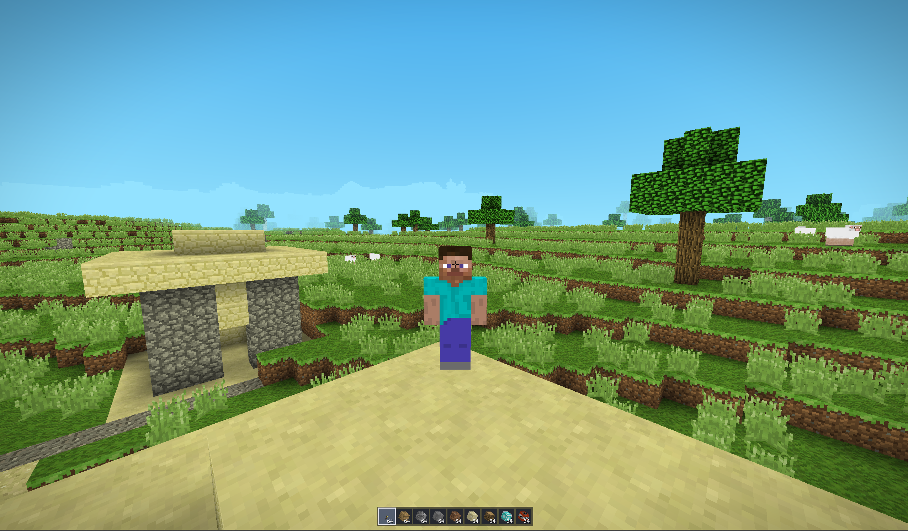
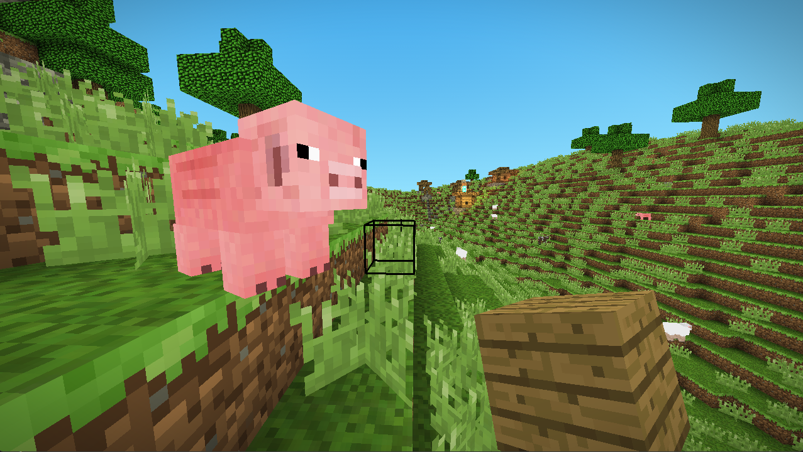

# Minecraft

[](https://github.com/HilthonTT/Minecraft/actions/workflows/ci.yml)
[](https://github.com/HilthonTT/Minecraft/actions/workflows/codeql.yml)
[](https://dotnet.microsoft.com/download)
[](LICENSE)

A voxel game engine written in C# with OpenGL and GLSL, built on [OpenTK](https://opentk.net/).

Infinite procedurally generated terrain across ten biomes, with oceans and the rivers that meander down to
them, ridged mountain ranges under snow and ice, banded mesas, marshes, buried ore, caves that open out of
hillsides, ravines with springs coming down their walls, and villages. Coloured block lighting with smooth
per vertex ambient occlusion, placeable torches, particles, distance fog, positional sound, a day/night cycle,
mobs, an inventory and hotbar, crafting and a ladder of tools that wear out, survival and creative modes, and
a client/server architecture that the singleplayer mode also runs through.


**[DESIGN.md](DESIGN.md)** covers how it all works — terrain generation, lighting, meshing, networking, the
save format and the sound engine.

## Requirements

- [.NET SDK 10](https://dotnet.microsoft.com/download) or newer
- Windows — texture loading goes through `System.Drawing`, so both projects target `net10.0-windows`
- A GPU and driver supporting OpenGL 3.3 or newer

The solution uses the `.slnx` format, which needs a recent SDK. Building the projects directly works with any
.NET 10 SDK.

## Running

```sh
dotnet build
dotnet run --project src/Minecraft.App
```

`dotnet test` runs the tests, which cover the parts of the engine that need neither a window nor a GPU.

That opens the main menu. `Singleplayer` lists your saved worlds, most recently played first — a row plays its
world and carries `Rename` and `Delete`, and `Create New World` names a world and picks its seed. `Escape`
during a game opens the pause menu, which is where you save and leave a world or quit.

In Visual Studio, pick a profile from the launch dropdown — `Singleplayer`, `Dedicated server` and
`Client (connect to localhost)` are defined in `src/Minecraft.App/Properties/launchSettings.json` and go
straight into a game without the menu.

### Worlds and seeds

The name offered on the create screen is one nothing is saved under yet, so pressing play generates a world;
type the name of a world you already have and it is carried on instead. The screen says which of the two it
would do, because a seed and a game mode only ever decide a world that does not exist yet — an existing one
keeps the ones it was made with.

The seed box takes a number, or any words, which are hashed into one. Leave it empty for a random seed;
`Random` fills one in so you can read it off first. Either way the seed is repeated in the chat on the way in,
so a world worth revisiting can be written down.

### Survival and creative

The create screen also picks which of the two the world is played in, and the button under `Game mode` moves
between them.

| | Survival | Creative |
| --- | --- | --- |
| Starting inventory | Empty | The nine blocks along the hotbar |
| Breaking a block | Held down, and takes as long as the block is hard, divided by the tool | Instant |
| A broken block | Falls where it stood, to be walked over — if the tool was good enough | Leaves nothing |
| Tools | Made at a bench, and wear out | Nothing to break, and nothing to break it with |
| Placing a block | Comes out of the stack in hand | Costs nothing |
| Throwing one down | `Q`, or `Ctrl` + `Q` for the stack | Nothing to throw away |
| Inventory screen | A bench, and the rows you are carrying | Those, plus everything in the game to take from |
| Health | Ten hearts above the hotbar, and zombies and long falls take them | None; nothing can touch you |
| Flying | No | Double tap `Space` |
| Reach | Five blocks, which is as far as a drop can be picked up from | Forty |

Typing `/gamemode survival` or `/gamemode creative` into the chat moves between the two while playing —
`/gm s` and `/gm c` do the same — and the world remembers which it was left in. Switching empties what you
are carrying, since a hotbar filled from creative's supply is not one survival ever had to earn.

`Q` throws down one of whatever is in hand and `Ctrl` + `Q` throws the whole stack, a couple of blocks out in
front of you. What lands cannot be picked up again for two seconds, which is long enough to turn round and
walk off without it following you back into the hotbar. Creative has no use for it — there is nothing to be
rid of when every slot is bottomless — so the key does nothing there.

A blow leaves ten seconds' grace and then the bar mends itself a half heart every four seconds, because there
is nothing to eat yet. Dying puts you back at the world spawn with everything you were carrying.

### Playing together

A hosted world listens on every network interface, so the singleplayer world and the one friends join are the
same thing. Start a game, and the chat says which address to give them; they pick `Multiplayer`, type it in and
connect. `Host Game` on the multiplayer screen does exactly what `Singleplayer` does, and is there so that
hosting is findable from the screen where it is wanted. For a world with nobody playing on the machine that
runs it, use a dedicated server instead.

### Start arguments

Every argument is optional; anything left out uses its default.

| Argument   | Values                             | Default        | Purpose                                 |
| ---------- | ---------------------------------- | -------------- | --------------------------------------- |
| `mode`     | `client`, `server`, `clientserver` | `clientserver` | `clientserver` is singleplayer          |
| `ip`       | Host to connect to                 | `127.0.0.1`    | A server always listens on every one    |
| `port`     | `1`–`65535`                        | `25565`        |                                         |
| `world`    | Save directory name                | `world`        | Which world to load or create           |
| `seed`     | Any whole number                   | random         | Only used when creating a new world     |
| `gamemode` | `survival`, `creative`             | `survival`     | Only used when creating a new world     |
| `menu`     | `true`, `false`                    | `true`         | `false` skips the main menu             |
| `fresh`    | `true`, `false`                    | `false`        | Deletes `world` first, then regenerates |
| `loglevel` | `packet`, `info`, `warn`, `error`  | `error`        | `packet` traces network traffic         |

```sh
dotnet run --project src/Minecraft.App -- mode=server port=25565 loglevel=info
dotnet run --project src/Minecraft.App -- world=canyons seed=12345 gamemode=creative
```

`server` runs headless. `client` connects to a server started separately. `world`, `seed`, `gamemode` and
`fresh` describe the world a game started from the arguments opens; a game started from the menu takes its
name, seed and mode from the menu instead, and never deletes anything.

## Controls

| Input           | Action                                     |
| --------------- | ------------------------------------------ |
| `W` `A` `S` `D` | Move                                       |
| Mouse           | Look                                       |
| `Space`         | Jump, swim upwards, or ascend while flying |
| `Space` twice   | Toggle flying                              |
| `Shift`         | Crouch, or descend while flying            |
| `Ctrl`          | Sprint                                     |
| Left click      | Hit a mob, or hold to break a block        |
| Right click     | Place block, or interact (a crafting table, TNT) |
| Middle click    | Pick the block being looked at             |
| `1`–`9`         | Choose a hotbar slot to build with         |
| Scroll wheel    | Step along the same nine                   |
| `Q`             | Throw down one of what you are holding     |
| `Ctrl` + `Q`    | Throw down the whole stack                 |
| `E`             | Open and close the inventory               |
| `Enter`         | Open and send chat                         |
| `Escape`        | Open the pause menu, or close the chat     |
| `F5`            | Cycle first person, behind, and facing you |

`F5` steps through the three views: out of your own eyes, from over your shoulder, and from in front looking
back at you. Either of the two that show your body pulls the camera four blocks off along your line of sight,
stopping short of anything solid so it never ends up inside a wall. What you are looking at does not move with
the camera — a block is still broken and placed from where you are standing.



Function keys drive the debug tools: `F1` hitboxes, `F2` debug readout, `F3` collect garbage, `F4` clear blocks
around the player, `F6` detached overhead camera, `F7` light level overlay (`Up`/`Down` picks the level),
`F8` fill a chunk layer with TNT, `F9` build a test room, `F10` chunk borders.

### Inventory and hotbar

Nine slots run along the bottom of the screen. Whichever is selected is also drawn in your hand, and its name
fades in above the bar as you reach for it. A creative world starts you carrying a torch, planks, cobblestone,
stone, dirt, sand, an oak log, glowstone and TNT; a survival one starts you with nothing and the row fills as
you dig.


`E` opens the inventory: three rows of storage, the same nine hotbar slots at the bottom, and — in creative —
everything in the game across the top. Left click picks a whole stack up onto the cursor and puts it down
again, right click takes half or places one at a time, and dropping a stack onto a slot that already holds the
same thing pours the two together. Clicking that list with a full cursor throws that stack away.

That list is a supply with nothing behind it, so survival leaves it off the screen altogether: what is
carried there comes out of the ground or off a bench, and a list of everything would be a way of helping
yourself to the things the mode is about earning.


Pointing at something in the world and clicking the middle mouse button still reaches for it directly: if it
is already on the hotbar that slot is selected, and in creative it is otherwise put into the slot in hand. In
survival the second half of that would be a stack conjured out of the ground by looking at it, so there it
only ever selects a slot that already holds the block.

### Crafting

The inventory screen carries a two by two bench, and a crafting table opens a three by three one — walk up to
one you have placed and right click it. What is laid out makes what it makes; the slot beside the bench shows
it, and clicking that slot takes it and spends one of everything on the bench, so holding the button down over
a bench of planks turns them into sticks a batch at a time. Nothing is left behind on a table: closing the
screen hands whatever was on it back to you.

Where the line falls between the two benches is the shape of the first ten minutes. Everything needed to reach
a first pickaxe fits in the small one, and every tool needs the large one:

| | Laid out | Makes |
| --- | --- | --- |
| Planks | One log, anywhere | Four planks |
| Sticks | Two planks, one above the other | Four sticks |
| Crafting table | Four planks in a square | One table |
| Torches | Coal above a stick | Four torches |
| Sandstone | Four sand in a square | One sandstone |
| Pickaxe | Three across the top, two sticks down the middle | One pickaxe |
| Axe | Two across, one below on the same side, two sticks | One axe |
| Shovel | One, two sticks under it | One shovel |
| Sword | Two, one stick under them | One sword |

The four tool shapes are made in five materials — planks, cobblestone, iron, gold and diamond — which is the
same picture laid out in whatever is to hand.

### Tools

A tool digs the blocks it is the right tool for faster, and for some of them it is the difference between a
drop and nothing at all. Punching stone still breaks it; it just leaves no cobblestone behind. What is buried
below a seam is the same rule read deeper — a wooden pickaxe reaches coal, a stone one iron, an iron one gold,
redstone and diamond.

| Material | Digs | Reaches | Lasts |
| --- | --- | --- | --- |
| Wood | 2× | Coal | 59 |
| Stone | 4× | Iron | 131 |
| Iron | 6× | Gold, redstone, diamond | 250 |
| Gold | 12× | Coal | 32 |
| Diamond | 8× | Gold, redstone, diamond | 1561 |

Gold is off to one side of the ladder rather than on it: it digs faster than diamond and wears out faster than
wood, so it is a thing to spend a lucky vein on rather than a step on the way anywhere.

A tool wears by one for each block it gets through and each blow it lands, and a slot holding a worn one
shows a bar under it, green while there is plenty left and red as it runs out. When the last of it goes the
slot simply empties.

A sword is the one tool that is not for digging — no block is broken faster by one — and what it is for is
mobs. It hits for four half hearts in wood up to seven in diamond, against the one a bare fist is worth; the
digging tools are worth one less each, in the order they are worse shaped for it.

Iron and gold ore drop the ingot rather than the ore block. There is no furnace to smelt anything in — that
wants a block which holds things, which is the same piece of work chests are waiting on — and a ladder that
stopped at stone for want of it would be a ladder with nothing at the top. So the pickaxe having to be good
enough to reach the seam is what stands in for the smelting.



## Options

`Options`, from the title screen or the pause menu, sets:

| Setting           | Range           | Notes                                                      |
| ----------------- | --------------- | ---------------------------------------------------------- |
| Render distance   | 2–16 chunks     | Moves the fog and the horizon with it                       |
| Field of view     | 60°–110°        | Sprinting and crouching still widen and narrow it from there |
| Volume            | 0–100%          |                                                             |
| Mouse sensitivity | 10%–150%        |                                                             |

Every one of them applies as the slider moves, and the pause menu only dims the world rather than covering it,
so a setting can be judged against the thing it changes. They are written to `options.txt` next to the
executable when you leave the screen.

Changing the render distance while playing takes effect immediately, on a server as well as in a singleplayer
world: the client asks, and the server is what decides how much of the world to send.

## Saved worlds

Worlds live in `saves/<name>/` next to the executable, and are written by whichever side runs the server, so
singleplayer and a dedicated server save identically. A world is saved when a chunk unloads, every 60 seconds,
and on a clean exit — leave through the pause menu or by closing the window rather than killing the process, or
anything since the last autosave is lost.

Only chunks that were actually modified are stored; everything else is regenerated from the seed on demand. See
[DESIGN.md](DESIGN.md#saved-worlds) for the format and what that costs.

## Layout

| Project          | Purpose                |
| ---------------- | ---------------------- |
| `Minecraft.Core` | Engine library         |
| `Minecraft.App`  | Executable entry point |

The directories inside `Minecraft.Core` are listed in [DESIGN.md](DESIGN.md#project-layout).

## Contributing

See [CONTRIBUTING.md](CONTRIBUTING.md), and read [DESIGN.md](DESIGN.md) first if you are touching world
generation — determinism there is load bearing, and the rules are written down.

## Credits

Based on [Ladadoos/3D-Voxel-Game-Engine](https://github.com/Ladadoos/3D-Voxel-Game-Engine/tree/master) and
[Minecraft](https://www.minecraft.net/en-us).

## License

MIT — see [LICENSE](LICENSE).
