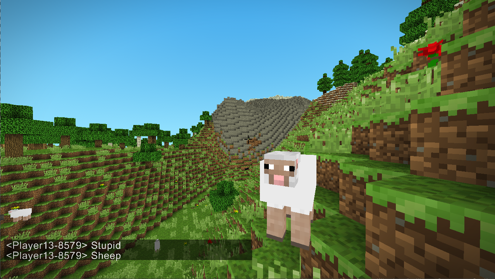
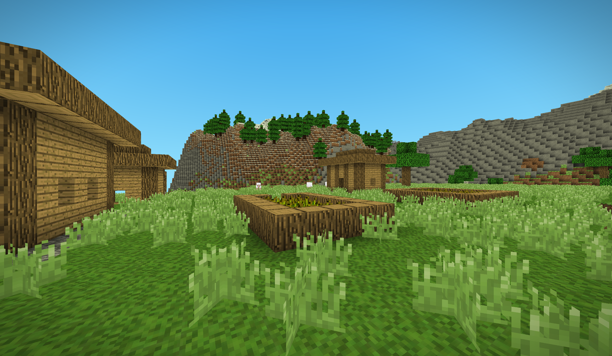
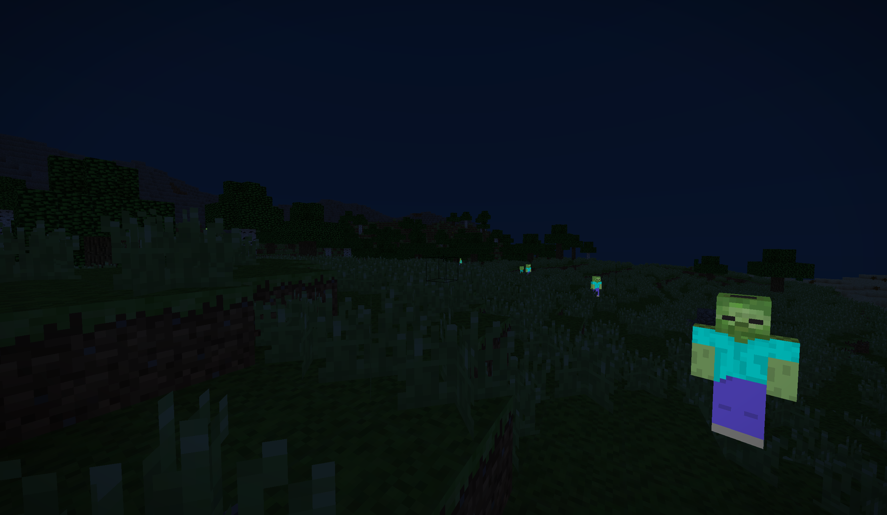

# Minecraft

A voxel game engine written in C# with OpenGL and GLSL, built on [OpenTK](https://opentk.net/).

Infinite procedurally generated terrain across six biomes, with ridged mountain ranges under snow and ice,
buried ore, caves and villages. Coloured block lighting with smooth per vertex ambient occlusion, a day/night
cycle, mobs, and a client/server architecture that the singleplayer mode also runs through.



## Requirements

- [.NET SDK 10](https://dotnet.microsoft.com/download) or newer
- Windows — texture loading goes through `System.Drawing`, so both projects target `net10.0-windows`
- A GPU and driver supporting OpenGL 3.3 or newer

The solution uses the `.slnx` format, which needs a recent SDK. Building the projects directly works with any
.NET 10 SDK.

## Running

```sh
dotnet build
dotnet run --project src/Minecraft.App
```

That starts a singleplayer game. In Visual Studio, pick a profile from the launch dropdown — `Singleplayer`,
`Dedicated server` and `Client (connect to localhost)` are defined in
`src/Minecraft.App/Properties/launchSettings.json`.

### Start arguments

Every argument is optional; anything left out uses its default.

| Argument   | Values                              | Default        | Purpose                             |
| ---------- | ----------------------------------- | -------------- | ----------------------------------- |
| `mode`     | `client`, `server`, `clientserver`  | `clientserver` | `clientserver` is singleplayer      |
| `ip`       | Host to connect to or bind          | `127.0.0.1`    |                                     |
| `port`     | `1`–`65535`                         | `25565`        |                                     |
| `world`    | Save directory name                 | `world`        | Which world to load or create       |
| `seed`     | Any whole number                    | random         | Only used when creating a new world |
| `loglevel` | `packet`, `info`, `warn`, `error`   | `error`        | `packet` traces network traffic     |

```sh
dotnet run --project src/Minecraft.App -- mode=server ip=0.0.0.0 port=25565 loglevel=info
dotnet run --project src/Minecraft.App -- world=canyons seed=12345
```

`server` runs headless. `client` connects to a server started separately.

## World generation

Which biome a column belongs to is read off a climate map — temperature and moisture, each its own noise
field. The surface blocks come from whichever biome dominates, but the height is a blend of all of them, so
a border comes out as a slope rather than as a step.

| Biome       | Surface             | Character                                                    |
| ----------- | ------------------- | ------------------------------------------------------------ |
| Plains      | Grass over dirt     | Open and gentle, flowers through the grass, few trees         |
| Forest      | Grass over dirt     | Rolling, thick with oak and birch, mushrooms in the shade     |
| Savanna     | Grass over dirt     | Flat topped plateaus with a scramble between one and the next |
| Desert      | Sand over sandstone | Dunes marching across a broad basin, cactus and dead bush     |
| Mountain    | Bare stone          | Ridged spines and gullies, patched with gravel and moss       |
| Snowy peaks | Snowy grass         | The highest ground there is, pine over its lower shoulders    |

Above the snow line the ground goes under snow, with sheets of glacial ice across part of it. The line
itself wanders, so it does not draw a contour around every summit at exactly the same height. Anywhere the
ground drops three blocks or more from one column to the next is left as the bare rock of its biome, which
is what puts faces on the cliffs and keeps soil off them.

Underground, veins of coal, iron, gold, redstone and diamond are laid in bands by depth, along with pockets
of dirt, gravel and clay, and the occasional seam of glowstone that lights a cave when one breaks into it. A
vein belongs to the chunk its centre falls in but is laid down by every chunk it reaches into, so it comes
out whole instead of sheared off at a border. Caves are carved after the veins, so a tunnel cutting through
one leaves its face showing in the wall, and the floor of the world is bedrock.



## Mobs

Sheep graze by day and zombies come out after dark, both built as cuboid models wearing a Minecraft skin
sheet. Only the server runs their behaviour and physics; every client eases each mob towards the last
position and facing it was told about, the same way it does for other players.

Passive and hostile mobs are counted against caps of their own rather than one shared total. Sharing a cap
starves the animals out — a hostile mob follows the player and so never wanders far enough off to be
despawned, while an animal drifts away and is cleared. Hostile mobs left over from the night are cleared at
first light, unless somebody is stood close enough to watch it happen.



## Saved worlds

Worlds live in `saves/<name>/` next to the executable and are written by whichever side runs the server, so
singleplayer and a dedicated server save identically. A world is saved when a chunk unloads, every 60
seconds, and on a clean exit. Quit with `Escape` or by closing the window rather than killing the process,
or anything since the last autosave is lost.

```
saves/world/
  level.dat          format version, seed and time of day, as plain text
  chunks/c.0.-1.gz   one gzipped chunk, named after its grid position
```

Only chunks that were actually **modified** are stored. Everything else is regenerated from the seed on
demand, which is both faster and far smaller than writing terrain nobody has touched — a world that has only
been walked across saves nothing at all. This works because generation is fully deterministic: the noise
fields are seeded from `seed`, and each chunk's decoration draws from a `Random` seeded by mixing the world
seed with the chunk position. Two worlds created with the same seed generate byte-identical terrain.

That determinism is load bearing. If you add generation code, drive every random choice from the `Random`
handed to `IDecorator.Decorate`, never from an unseeded one, or stored chunks will stop matching their
regenerated neighbours.

Structures are held to the same rule, and to a stricter one on top of it. A village is larger than a chunk,
so every chunk it covers works out the whole layout from scratch and keeps only its own slice; two chunks
that disagreed would leave a house cut in half along the border. An `IStructure` therefore has to be a pure
function of the world seed and its position, and it reads the ground through `ITerrainSampler` — which
recomputes terrain from the seed — rather than out of the world, since the neighbouring chunks it spans are
not loaded while any one of them is being generated.

Passing `seed` for a world that already exists is ignored, with a warning — its terrain is already fixed. To
start over, delete the world directory or pick a different `world` name. A save whose `version` does not
match the running build is refused rather than misread, and a corrupt chunk file is reported and regenerated
instead of taking the world down with it.

## Controls

| Input                | Action                                            |
| -------------------- | ------------------------------------------------- |
| `W` `A` `S` `D`      | Move                                              |
| Mouse                | Look                                              |
| `Space`              | Jump, or ascend while flying                      |
| `Space` twice        | Toggle flying                                     |
| `Shift`              | Crouch, or descend while flying                   |
| `Ctrl`               | Sprint                                            |
| Left click           | Break block                                       |
| Right click          | Place block, or interact (TNT)                    |
| Middle click         | Pick the block being looked at                    |
| `Enter`              | Open and send chat                                |
| `Escape`             | Quit                                              |

Function keys drive the debug tools: `F1` hitboxes, `F2` debug readout, `F3` collect garbage, `F4` clear
blocks around the player, `F5` chunk borders, `F6` detached overhead camera, `F7` light level overlay
(`Up`/`Down` picks the level), `F8` fill a chunk layer with TNT, `F9` build a test room.

## Layout

| Project          | Purpose                       |
| ---------------- | ----------------------------- |
| `Minecraft.Core` | Engine library                |
| `Minecraft.App`  | Executable entry point        |

Inside `Minecraft.Core`:

| Directory              | Contents                                                                |
| ---------------------- | ----------------------------------------------------------------------- |
| `Entities/`            | Camera, the player on both sides of a connection, and the mobs           |
| `Games/`               | Game loop, window, start argument parsing                                |
| `IO/`                  | Buffered binary reader and writer for network packets                    |
| `Logging/`             | Levelled console logger                                                  |
| `Network/`             | Client, server, sessions, packets and their handlers                     |
| `Physics/`             | Axis aligned boxes and ray tracing                                       |
| `Render/`              | Master renderer, chunk meshing, debug overlays, UI                       |
| `Resources/`           | Textures, fonts and models, copied to the output directory on build      |
| `Shaders/`             | GLSL programs and their typed wrappers                                   |
| `Shapes/`              | Block and entity model geometry, and the registries that hold it         |
| `Textures/`            | Texture atlas and the offscreen framebuffer                              |
| `Utilities/`           | Math, input, noise, OBJ loading, VAO wrapper, object pool                |
| `Worlds/`              | Blocks, chunks, sections and lighting                                    |
| `Worlds/Biomes/`       | The biomes and the climate map that decides between them                 |
| `Worlds/Generation/`   | The generator itself: terrain sampling, ore veins and cave carving       |
| `Worlds/Decoration/`   | What each biome grows on its surface, and the trees it grows             |
| `Worlds/Structures/`   | Villages and the framework that sites them and builds them across chunks |
| `Worlds/Storage/`      | Reading and writing saved worlds                                         |

## How it fits together

The world only ever changes on the server. A client sends a request — place, break, interact — and applies
nothing until the server broadcasts the result back. Singleplayer runs the same path, with a server hosted in
the same process, so there is one code path rather than two.

Chunks are generated on a background thread and streamed per player, nearest first, by a `ChunkProvider` that
each session owns. A chunk stays loaded while at least one player can see it. Meshing runs on its own thread
and hands one finished mesh to the renderer at a time, which keeps the large vertex buffers reusable and stops
a chunk change from stalling a frame.

Lighting is a flood fill over four channels — red, green, blue and sunlight — packed into a `ushort` per
block. Placing or breaking a block repairs only the affected region rather than relighting the chunk, and
`SmoothLighting` averages the neighbouring cells at mesh time to get per vertex gradients and ambient
occlusion.

## Noise

Four generators live in `Minecraft.Core.Utilities.Noise`, all returning values in `[-1, 1]`, with `Noise01`
for the `[0, 1]` range that height maps usually want. The single octave fields are zero on the integer
lattice, so scale block coordinates down before sampling rather than feeding them in whole.

| Type                   | Use                                                            |
| ---------------------- | -------------------------------------------------------------- |
| `Noise2DPerlin`        | Single octave 2D gradient noise                                 |
| `Noise2DPerlinOctave`  | Fractal brownian motion over the above, for terrain height maps |
| `Noise3DPerlin`        | Improved 3D Perlin noise, for caves and ore distribution        |
| `TerrainNoise`         | Ridges, terraces and distribution flattening built on the above |

`TerrainNoise` is where the shapes that are not noise in themselves live. `Ridged01` folds a field about zero
to turn its smooth valleys into the creases a mountain range is built from, `Terrace01` cuts a range into
plateaus with an escarpment between them, and `Spread01` flattens the bell shaped distribution Perlin noise
produces into an even one — without which a climate map puts nearly the whole world into a single biome.

```csharp
using Minecraft.Core.Utilities.Noise;

// Reseed once at world creation so a seed always reproduces the same world.
Noise2DPerlin.Reseed(worldSeed);
Noise3DPerlin.Reseed(worldSeed);

// Terrain height: 4 octaves of 2D noise, remapped to a block height.
float height = Noise2DPerlinOctave.Noise01(blockX * 0.01f, blockZ * 0.01f, octaves: 4);
int surfaceY = (int)(height * 64) + 32;

// Caves: carve where the 3D field crosses a threshold.
bool isCave = Noise3DPerlin.Noise(blockX * 0.05f, blockY * 0.05f, blockZ * 0.05f) > 0.6f;
```

Both octave generators take `octaves`, `persistence` (amplitude falloff per octave), `lacunarity` (frequency
gain per octave) and a starting `frequency`. Lower the frequency for larger features.

## Credits

Based on [Ladadoos/3D-Voxel-Game-Engine](https://github.com/Ladadoos/3D-Voxel-Game-Engine/tree/master).
Based on [Minecraft](https://www.minecraft.net/en-us).

## License

MIT — see [LICENSE](LICENSE).
